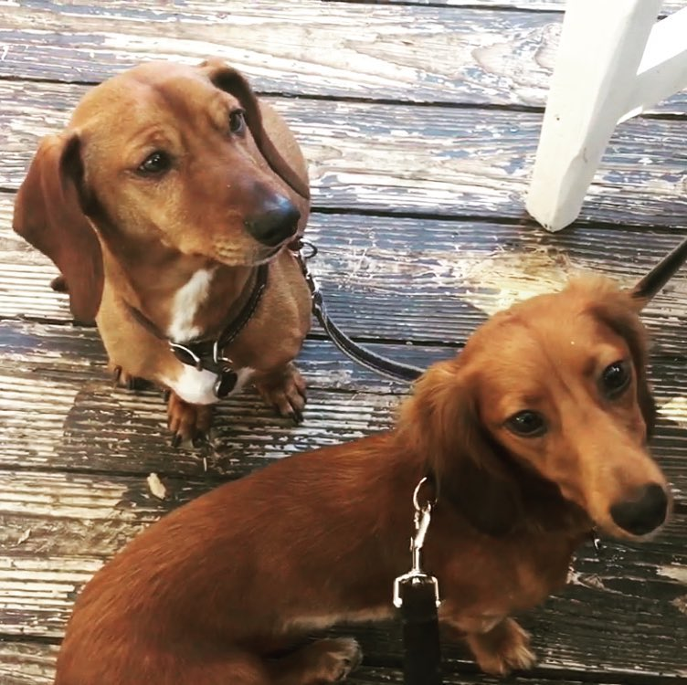

| **Home**      | **[Writing and Presentations](/writing-presentations.md)** |
| :----------- | -----------: |
| **[Research](/research.md)**          | **[Workshops and Teaching](/workshops-teaching.md)**       |
|   **[Grants and Awards](/grants-awards.md)**   | **[Exhibition and Public Humanities](/exhibition-publichumanities.md)**      |

## This is Professional Stephanie.

Currently I'm the Digital Humanities Archivist at the Maryland Institute for Technology in the Humanities (MITH) at University of Maryland, where I serve as a senior member of the research and development team for several projects and initiatives with a targeted focus on archival, digital curation, research data, digital library, and digital stewardship activities. 

My research revolves around using digital humanities methods alongside archival standards to reframe and contextualize historic media collections through the lens of their original production, reception, and networked distribution. I'm an affiliate faculty member of UMD's Cinema and Media Studies (CMS) department, where I teach a course on digital storytelling using archives. I'm also interested in the stewardship of digital humanities projects and research data, including streamlining project management, documentation, and sustainability processes.

In the past, I was the Project Manager for the [American Archive of Public Broadcasting](https://americanarchive.org/about-the-american-archive) at the Corporation for Public Broadcasting, where I managed strategic and operational planning for metadata and digitization initiatives involving 120 public broadcasting stations, over 2 million inventory records, and the digitization of 40,000 hours of content.

Before moving to DC in 2010, I was the Project Director on a Getty-funded grant for Los Angeles Filmforum entitled *[Alternative Projections: Experimental Film in LA 1945 -1980](https://www.alternativeprojections.com/)*, a historical survey and preservation project resulting in over 35 new oral histories, an academic symposium, a media-rich website and database and a 16+screening exhibition series. The project was part of the Getty’s Pacific Standard Time initiative showcasing postwar art in Los Angeles. I also served as Managing Director of [iotaCenter](http://iotacenter.org/), a small nonprofit film archive of experimental film and abstract animation.

I have a master's degree in Moving Image Archive Studies from UCLA, where my work focused on issues related to access to and reuse of historical media collections with a focus on broadcasting, experimental film and animation history. Before graduate school, I worked for six years as a researcher and producer on documentaries and television shows, specializing in finding and licensing archival footage and photos for use in productions. I have a bachelor's degree in Film Studies from the University of Kansas, and I'm also the current Vice President of the KU Film and Media Studies Professional Advisory Board. Rock chalk.

## This is Stephanie the Person.

I spent ten years of my early childhood on Long Island, twelve years of my middle childhood and college years in Kansas City and Lawrence, ten years of my formative adult years in Los Angeles, and have spent the remainder of my adulthood since 2011 in the DMV (DC, Maryland, Virginia) region. Although each of these was its own kind of cultural bubble, I believe in bursting bubbles and having a dialogue with those outside of my bubble.

I grew up obsessively reading books and then began obsessively watching films. Sometimes bands or recording artists allow me to [sing in front of people](https://scontent-iad3-2.xx.fbcdn.net/v/t1.6435-9/48277632_2265557873676704_5927721138166693888_n.jpg?_nc_cat=111&ccb=1-7&_nc_sid=cdbe9c&_nc_ohc=MxW1bevdwbEAX-41Jya&_nc_ht=scontent-iad3-2.xx&oh=00_AfD6Htc9ptMLtSOv6olfj8-kxREfZ5PWc3kyJSispp8QrQ&oe=63B05D43), or even [on albums](https://stettes.bandcamp.com/album/future-shit). I make furniture and craft art out of upcycled materials, and I occasionally [perform live storytelling](https://www.instagram.com/p/2xU1BnGwRQ/). I am a culinary and wine enthusiast. I know how pretentious that sounds. These are my two dogs, who (unlike me) are natural redheads.

