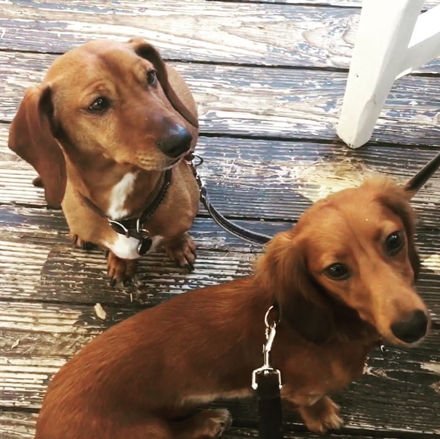

| **Home**      | **[Writing and Presentations](/writing-presentations.md)** |
| :----------- | -----------: |
| **[Research](/research.md)**          | **[Workshops and Teaching](/workshops-teaching.md)**       |
|   **[Grants and Awards](/grants-awards.md)**   | **[Exhibition and Public Humanities](/exhibition-publichumanities.md)**      |

## This is Professional Stephanie.

I am the Digital Humanities Archivist at the [Maryland Institute for Technology in the Humanities at the University of Maryland](https://mith.umd.edu/), where my work moves across digital storytelling, archival curation, linked data, and the long afterlives of audiovisual history. I build workflows and interpretive models that help illuminate how collections originate, circulate, decay, and reappear. I treat collections as artifacts with their own biographies. Their histories include periods of care and neglect, moments of abandonment, and the possibility of rediscovery.

My work is ultimately about reactivation. To follow a fragile collection back into the world is to participate in its next chapter. I build structures that support that return, and I prefer to work with the kinds of media collections that tend to slip through the cracks. The endangered ones, the orphaned ones, the ones that survive by accident and then sit quietly on a shelf until someone is willing to listen to them. Much of my career has unfolded in these spaces of material fragility, where gaps and absences carry as much meaning as what remains.

In the past few years I have explored the affordances of linked data as not only a technical framework but a way of allowing dispersed or invisible cultural fragments to find each other again. A guiding principle in this work is Deleuze and Guattari’s concept of the rhizome. It offers a way of thinking about human knowledge that resists hierarchy and centers the idea of many beginnings. It makes room for multiple pathways and unexpected connections. It also matches how I tend to work: moving laterally through complexity, following threads that emerge in the moment, and recognizing the value of chaos without needing to tidy it into something it never was.

In my role as affiliate faculty in the Cinema and Media Studies program, I teach a course on digital storytelling with archives. I invite students to write their own 'media autobiography,' engage with obsolete media and playback equipment, and understand how formats age and what it means to touch a technology that no longer has a natural place in the world. Ultimately they create a new creative work that incorporates archival elements.

Before my time at MITH, I managed the [American Archive of Public Broadcasting](https://americanarchive.org/about-the-american-archive), directed a Getty-funded initiative for Los Angeles Filmforum called *[Alternative Projections: Experimental Film in LA 1945 -1980](https://www.alternativeprojections.com/)*, and served as Managing Director of [iotaCenter](http://iotacenter.org/), a nonprofit film archive specializing in experimental film and abstract animation. Earlier in my career, I worked as a researcher and producer in documentary film and television series, spending my days tracking down archival footage and images. I hold a graduate degree in Moving Image Archive Studies from UCLA and a bachelor’s degree in Film and Media Studies from the University of Kansas, where I now serve on the Professional Advisory Board.

## This is Stephanie the Person.

I spent ten years of my early childhood on Long Island, twelve years of my middle childhood and college years in Kansas City and Lawrence, ten years of my formative adult years in Los Angeles, and have spent the remainder of my adulthood since 2011 in the DMV (DC, Maryland, Virginia) region. Although each of these was its own kind of cultural bubble, I believe in bursting bubbles and having a dialogue with those outside of my bubble.

I grew up obsessively reading books and then began obsessively watching films. Sometimes bands or recording artists allow me to [sing in front of people](https://scontent-iad3-2.xx.fbcdn.net/v/t39.30808-6/511163881_10160769136266090_3536348456488456062_n.jpg?_nc_cat=105&ccb=1-7&_nc_sid=cc71e4&_nc_ohc=JNYVdByU4nYQ7kNvwHwovap&_nc_oc=AdlZ1BZMSMHEJ1XacMgjyIVejYOHCAAagBN1XDj8ia5UBZxoTbHhE_9B7HlzBeG5Aro&_nc_zt=23&_nc_ht=scontent-iad3-2.xx&_nc_gid=oLNfW3fMsxaSlRVw3z79LA&oh=00_AfcJpSb0-R3-YoK-OQezbc9kzmw8c-OVd2WiVXYvdSaYcg&oe=690AEBE6), sing [on albums](https://stettes.bandcamp.com/album/future-shit), or make [music videos](/video-work). I make furniture and craft art out of upcycled materials, and I occasionally [perform live storytelling](https://www.instagram.com/p/2xU1BnGwRQ/). These are my two dogs, who (unlike me) are natural redheads.

