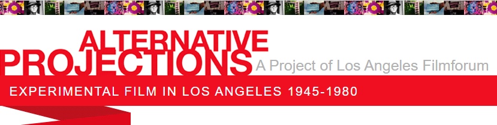

| **[Home](https://ssapienza.github.io/ssapienza/)**      | **[Writing and Presentations](writing-presentations.md)** |
| :----------- | -----------: |
| **Research**          | **[Workshops and Teaching](/workshops-teaching.md)**       |
|   **[Grants and Awards](/grants-awards.md)**   | **[Exhibition and Public Humanities](/exhibition-publichumanities.md)**      |

## Research Highlights

Some highlights from my favorite archival and research projects. For a full list, [download my CV](/documents/sapienza-cv.pdf).

---

### Unlocking the Airwaves ###

This is a project five years in the making, which directly built on my previous work managing the American Archive of Public Broadcasting (see below). The project launched in July 2021. You can read my own personal journey on the MITH website: **[On Forks and Completion: Reflections on a Five-year Digital Humanities Project](https://mith.umd.edu/news/unlocking-the-airwaves-launch/)**.

Before the ubiquity of National Public Radio (NPR) and the Public Broadcasting Service (PBS), the National Association of Educational Broadcasters (NAEB) was the primary institution responsible for promoting and distributing public broadcasting content in the United States. The NAEB collections, which are currently split between the University of Maryland (audio) and the Wisconsin Historical Society (paper collections), provide an in-depth look at the messages being broadcast to the general public through the rubric of ‘educational radio,’ which predated (and heavily informed) what we now know as public radio, between 1950-1970. 

The Airwaves website application virtually reunifies the split collections of the NAEB to tell the story of early educational and public broadcasting, along with curatorial enhancements such as digital exhibits and visualizations. To do this, we used a lot of different strategies from both the digital humanities and archival studies: virtual reunification, linked data, minimal computing, static site generation, and synced audio/transcripts for the radio broadcasts. This project was funded by a grant from the National Endowment for the Humanities.

---

### The Lakeland Digital Archive ###

Lakeland is a historical African American neighborhood in College Park, Maryland adjacent to the University of Maryland and located less than 10 miles from Washington, DC. Present since the 1800’s, Lakeland established deep roots across generations of families, until a late 70’s urban renewal process forced the removal of 104 family homes, as well as familiar landmarks, to make way for student apartments and the expansion of the DC metro line for city commuters. 

The Lakeland Community Heritage Project (LCHP) was born out of a conversation between community members to save the history of their dying neighborhood, with a mission to ensure that the stories of their community were known to new residents and younger generations. The LCHP started as a grassroots efforts to build an archive, and then eventually expanded to take on partnerships at the University of Maryland. Alongside partners in American Studies and MITH, the LCHP has now received four grants, conducted over 100 oral histories, and collected over 10,000 documents, photos, maps, and publications to constitute the Lakeland Digital Archive (LDA).

Throughout my years on this project, I've been intimately involved with organizing all of the above materials, including designing a database and forthcoming website which allows seamless exploration of the oral histories alongside the related documents and memorabilia. I also helped organize several community digitization events at which community members could come in and have their materials scanned by the team. The technical team at MITH has employed a minimal computing framework to the launch of this archive online, to ensure that the archive is both sustainable and that the community has input at every stage of the process. I also produced a five minute short documentary to be screened to the City of College Park as part of an ongoing negotiation about restorative justice, [which can be seen here](https://vimeo.com/467789439).

---

### Alternative Projections ###

I was the Project Director on a Getty-funded grant project for Los Angeles Filmforum entitled _Alternative Projections: Experimental Film in LA 1945  -1980_, a historical survey and preservation project resulting in over 35 new oral histories, an academic symposium, a media-rich website and database and a 16+screening exhibition series. The project was part of the Getty’s _Pacific Standard Time_ initiative showcasing postwar art in Los Angeles.  

This project was an all-time career highlight. I got to assemble a dream team Advisory Board of filmmakers, historians and curators; supervise the work of five researchers; travel all over the country shooting oral histories; organize [an academic symposium](/2010_Symposium.html) which included [screenings](/Symposium-Screenings.html), [panel presentations](/Symposium-Presentations.html), and [art installations/exhibits](/Symposium-SpecialEvents.html); supervise the curation of screenings all over LA in conjunction with other cultural organizations; and work with the Academy Film Archive to preserve select films and strike new prints for preservation and exhibition purposes. It was a rewarding three years of my life. 

The [website for _Alternative Projections_](http://www.alternativeprojections.com/) was our final official digital publication about our work which was funded by the Getty grants. There you can see the database of films, artists, organizations and curators which comprised this era of rich artistic experimentation and innovation in the postwar era. Additionally, [a book was published about the project](https://lareviewofbooks.org/article/alternative-projections-and-the-history-of-los-angeles-filmforum/), edited by Filmforum board member and advisory board member David James and Filmforum Executive Director Adam Hyman.

---

### Animation Restoration Website ###

This is an oldie but a goodie. I excitedly just archived several older websites that I published while I was a graduate student at UCLA. This includes my final course project (a website) for the UCLA Moving Image Archive Studies course Archaeology of the Medium, taught by Michael Friend. 

[The website showcases various early technologies used in animation](/animation-restoration), and how modern-day animation restoration practice does (or does not) intersect with those technologies. I was working at the Disney Animation Research Library at the time and had access to many folks who gladly gave their time and expertise to give me insight into the processes they employed. Note that those podcasts are not playable/published on the archived site, at the request of the interviewees. 

I ended up turning this into a longer paper for a subsequent course (Contemporary Restoration), titled "The Magnificent Umbers: Issues in Animation Restoration." [You can read that here too](/documents/ucla-mias210-restoration-final-paper.pdf), if you'd like :).
